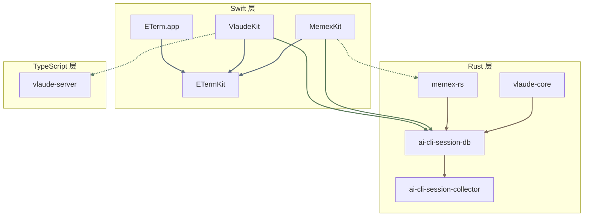
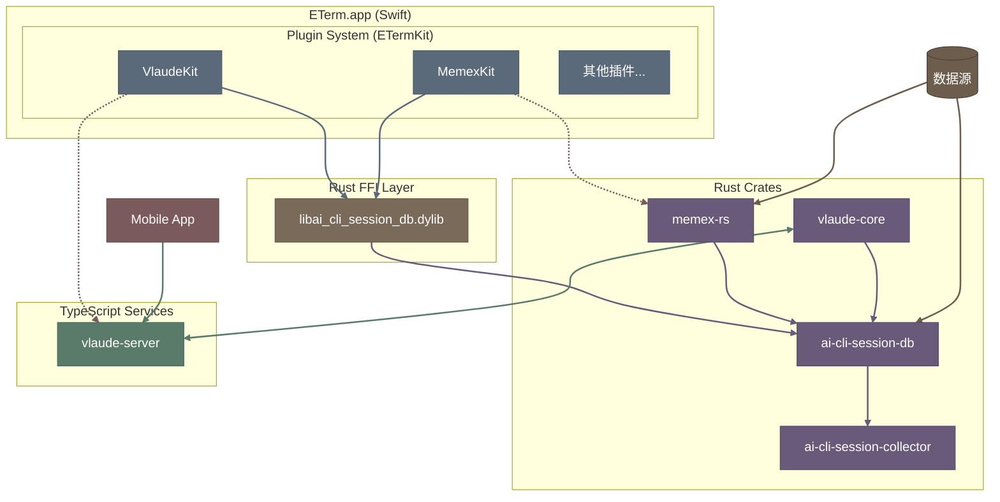
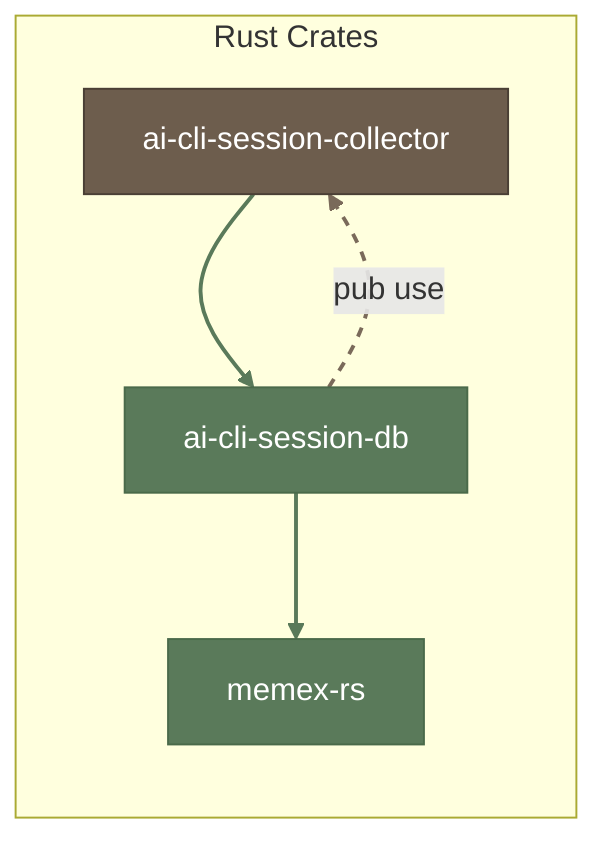
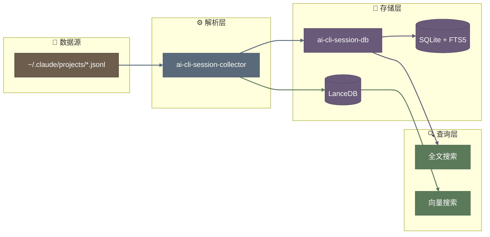

# ETerm 工作空间架构文档

> 最后更新: 2025-12-31

## 概述

ETerm 是一个以 Claude Code 会话管理为核心的工具生态系统，包含 macOS 终端应用、会话同步服务、历史搜索系统等组件。

采用 **Git Submodule + Cargo Workspace** 架构：子项目独立维护，主仓库统一编译。

---

## 架构总览

### 仓库架构

```
ETerm/                              # 主仓库 (Cargo workspace)
├── Cargo.toml                      # workspace + [patch] 统一依赖
├── scripts/build.sh                # 统一编译入口
│
├── ai-cli-session-collector/       # submodule: JSONL 解析器
├── ai-cli-session-db/              # submodule: 数据库 + FFI
├── memex/memex-rs/                 # submodule: Memex 后端
├── claude/packages/
│   ├── vlaude-core/                # 独立 workspace: Rust daemon
│   └── vlaude-server/              # TypeScript 云端服务
│
└── english/                        # ETerm 主项目 (Swift)
    └── Plugins/
        ├── VlaudeKit/              # 使用 ai-cli-session-db FFI
        └── MemexKit/               # 使用 ai-cli-session-db FFI
```

### 依赖策略

- **子项目使用 git 依赖**：支持独立 clone、独立编译
- **主仓库使用 [patch]**：开发时自动覆盖为本地路径

```toml
# ETerm/Cargo.toml
[patch."https://github.com/vimo-ai/ai-cli-session-collector"]
ai-cli-session-collector = { path = "ai-cli-session-collector" }
```

### 项目依赖关系



### 系统分层架构



### Rust 依赖关系

`ai-cli-session-db` 作为统一入口，re-export `ai-cli-session-collector` 的类型。



### 数据流



---

## 项目结构

```
ETerm/
├── english/                    # ETerm macOS 应用
│   ├── ETerm/                  # Swift 主程序
│   ├── Plugins/                # 外部插件
│   │   ├── VlaudeKit/          # Vlaude 插件
│   │   ├── MemexKit/           # Memex 插件
│   │   └── ...
│   └── Packages/               # 共享 Swift 包
│       └── ETermKit/           # 插件 SDK
│
├── claude/                     # Vlaude 服务
│   └── packages/
│       ├── vlaude-core/        # 本地 Mac daemon (Rust, 独立 workspace)
│       ├── vlaude-server/      # 云端服务 (TypeScript)
│       └── ...
│
├── memex/                      # Memex 服务
│   ├── memex-rs/               # Rust 后端
│   └── ...                     # NestJS 旧版本 (待迁移)
│
├── ai-cli-session-db/          # 共享数据库层 (Rust)
│
└── ai-cli-session-collector/   # JSONL 解析器 (Rust)
```

---

## 核心组件

### 1. ai-cli-session-collector

**职责**: 纯解析库，解析 AI CLI 工具的会话数据

| 属性 | 值 |
|------|-----|
| 语言 | Rust |
| 类型 | Library |
| 位置 | `/ai-cli-session-collector` |

**支持的数据源**:
- Claude Code (`~/.claude/projects/**/*.jsonl`)
- Codex CLI (`history.jsonl` + rollout)

**输出类型**:
- `ParsedMessage` - 解析后的消息
- `SessionMeta` - 会话元数据
- `ClaudeAdapter` / `CodexAdapter` - 各格式适配器

**特点**:
- 无 IO 依赖（不含数据库、网络等）
- 纯函数式解析

---

### 2. ai-cli-session-db

**职责**: 统一的数据访问层，为所有组件提供会话解析、存储和搜索

| 属性 | 值 |
|------|-----|
| 语言 | Rust |
| 类型 | Library + FFI |
| 位置 | `/ai-cli-session-db` |
| 依赖 | ai-cli-session-collector |

**核心功能**:
- Re-export `ai-cli-session-collector` 类型（统一入口）
- 数据库读写（SQLite + FTS5）
- FFI 导出（供 Swift 调用）

**Feature Flags**:
| Feature | 说明 |
|---------|------|
| `writer` | 写入能力 |
| `reader` | 只读能力 |
| `search` | FTS5 全文搜索 |
| `coordination` | 多 Writer 协调 |
| `ffi` | C FFI 导出 (Swift 绑定) |

**Writer 协调机制**:

4 个组件共享 `~/.vimo/db/ai-cli-session.db`：

| 组件 | WriterType | 优先级 | 触发方式 | 覆盖范围 |
|------|------------|--------|----------|----------|
| VlaudeKit | `vlaudeKit` | 2 | ClaudeKit Hooks | ETerm 内 Claude |
| MemexKit | `memexKit` | 2 | ClaudeKit Hooks | ETerm 内 Claude |
| vlaude-daemon | `VlaudeDaemon` | 1 | 文件监听 (FSEvents) | 所有 Claude |
| memex-rs | `MemexDaemon` | 1 | 文件监听 (FSEvents) | 所有 Claude |

协调规则：
- 高优先级可抢占低优先级
- 同优先级先到先得
- 心跳 10s，超时 30s 后可接管
- Reader 定时检查 Writer 是否超时，自动接管

**触发方式说明**：
- **ClaudeKit Hooks**: 通过 Claude CLI 的 hooks 机制精确触发，毫秒级响应，可获得 terminalId/sessionId/transcriptPath
- **文件监听**: 通过 FSEvents 监听 `~/.claude/projects/` 目录变化，100-500ms 延迟，需要扫描判断变化

**覆盖范围边界**：
- ETerm 插件（VlaudeKit/MemexKit）只能感知 ETerm 内的 Claude 活动
- 当 ETerm 打开但用户在外部（终端/VS Code）使用 Claude 时，插件无法感知，**这是设计边界，不做处理**
- 如需覆盖外部 Claude 活动，应关闭 ETerm 并运行 daemon

**7 种运行场景**：

| # | ETerm | Memex | Vlaude | Writer | 说明 |
|---|:-----:|:-----:|:------:|--------|------|
| 1 | ✅ | - | - | 插件 | 日常开发，只索引 ETerm 内 Claude |
| 2 | - | ✅ | - | memex-rs | 后台索引所有 Claude 活动 |
| 3 | - | - | ✅ | daemon | 后台索引 + 远程同步 |
| 4 | ✅ | ✅ | - | 插件 | memex-rs 降级为 Reader |
| 5 | ✅ | - | ✅ | 插件 | daemon 降级为 Reader |
| 6 | - | ✅ | ✅ | 先到先得 | 两个 daemon 竞争 |
| 7 | ✅ | ✅ | ✅ | 插件 | daemon 们都降级为 Reader |

**产出**:
- `libai_cli_session_db.dylib` - Swift FFI 调用（包含解析和数据库功能）

---

### 3. memex-rs

**职责**: Claude Code 会话历史管理后端

| 属性 | 值 |
|------|-----|
| 语言 | Rust |
| 类型 | Binary + Library |
| 位置 | `/memex/memex-rs` |
| 依赖 | ai-cli-session-db |

**功能**:
- HTTP API 服务 (`:10013`)
- 文件监听 + 增量索引
- FTS5 全文搜索
- LanceDB 向量搜索
- Ollama Embedding 集成
- MCP Server

**产出**:
- `memex` 二进制 - MemexKit 嵌入使用

---

### 4. ETerm.app

**职责**: macOS 终端应用，提供插件化的终端体验

| 属性 | 值 |
|------|-----|
| 语言 | Swift |
| 位置 | `/english/ETerm` |

**插件系统**:
- 基于动态库加载 (`.dylib`)
- 进程隔离架构（可选）
- 通过 `ETermKit` SDK 开发

---

### 5. VlaudeKit

**职责**: ETerm 插件，提供跨设备会话同步

| 属性 | 值 |
|------|-----|
| 语言 | Swift |
| 类型 | ETerm Plugin |
| 位置 | `/english/Plugins/VlaudeKit` |

**依赖**:
- `SharedDbFFI` - 数据库访问 + JSONL 解析
- Socket.IO → vlaude-server

**功能**:
- 连接云端 vlaude-server
- 接收移动端发送的消息
- 本地会话读取和搜索

---

### 6. MemexKit

**职责**: ETerm 插件，提供会话历史搜索

| 属性 | 值 |
|------|-----|
| 语言 | Swift |
| 类型 | ETerm Plugin |
| 位置 | `/english/Plugins/MemexKit` |

**依赖**:
- `SharedDbFFI` - 数据库访问 + JSONL 解析
- `memex` 二进制 - HTTP 服务

**功能**:
- 启动 memex 作为子进程
- 全文搜索历史会话
- 向量语义搜索

---

### 7. Vlaude 服务

**职责**: 跨设备 Claude Code 会话同步系统

| 组件 | 语言 | 说明 |
|------|------|------|
| `vlaude-core` | Rust | 本地 Mac daemon，监听会话变化，独立 workspace |
| `vlaude-server` | TypeScript | 云端服务，转发消息 |

**技术栈**:
- vlaude-core: Rust + tokio + ai-cli-session-db
- vlaude-server: NestJS + Socket.IO + Prisma

---

## 开发指南

详细开发流程请参考 [DEVELOPMENT.md](./DEVELOPMENT.md)

### 统一编译

```bash
# 在 ETerm 根目录
./scripts/build.sh          # 编译所有
./scripts/build.sh ffi      # 编译 FFI
./scripts/build.sh memex    # 编译 memex
./scripts/build.sh plugins  # 构建 Swift 插件
```

### 修改后更新下游

| 修改的项目 | 运行命令 |
|-----------|---------|
| ai-cli-session-collector | `cd ai-cli-session-collector && ./scripts/update_downstream.sh` |
| ai-cli-session-db | `cd ai-cli-session-db && ./scripts/update_downstream.sh` |
| memex-rs | `cd memex/memex-rs && ./scripts/update_eterm.sh` |

### 插件开发

参考 `/english/Plugins/PLUGIN_SDK.md`

```bash
cd english/Plugins
./create-plugin.sh MyPlugin
cd MyPluginKit && ./build.sh
```

---

## 版本历史

| 日期 | 说明 |
|------|------|
| 2025-12-31 | 采用 Git Submodule + Cargo Workspace 架构，统一编译脚本 |
| 2025-12-31 | vlaude-daemon 重构为 Rust (vlaude-core) |
| 2025-12-31 | 完成依赖统一重构，移除重复依赖 |
| 2025-12-31 | 初始架构文档 |
